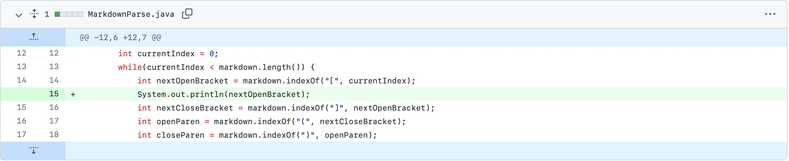
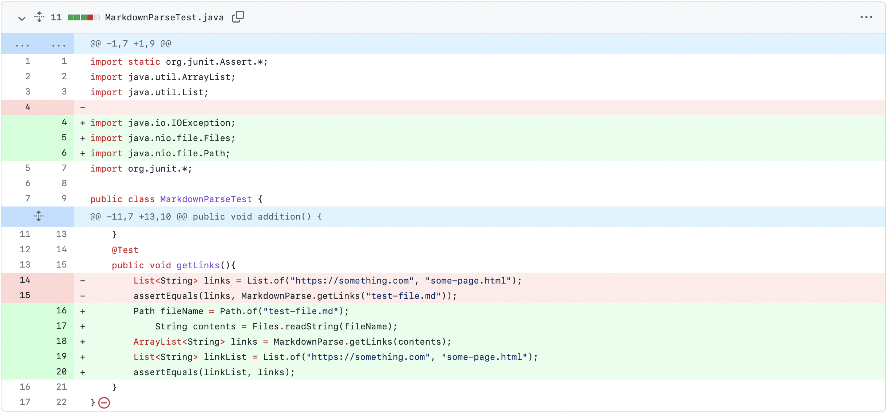
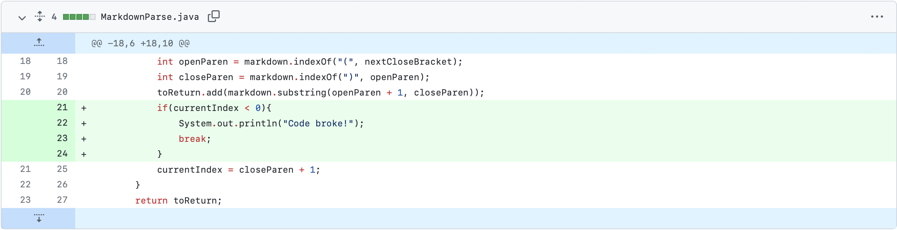

# Lab Report 2: When Tests Accumulate

## **Implementation of First Test**


[Error-Causing Test: (Link)](https://github.com/stanley-pan/markdown-parse/commit/ba15ad6241309afa02d51c3a448cc58846177004#diff-d902b3a6dba925548b7ea18ffb80dd0c28f1bc45f1d738a5da414273711a4409)

### **Output/Symptom of the Error:**
```
-1
42
-1
42
-1
42
-1
42
-1
42
-1
42
# ... infinite loop
```

In this first example, **underlying bug was revealed by the symptoms of the failure-inducing input**. 

In other words, the only way to detect if there was an underlying problem in the code was to first check if such problem-inducing inputs can cause an issue, where in this case the infinite loop between `-1` and `42` was the resulting symptom from that input. 

It reveals that there is an underlying issue *(a bug!)* with the code that causes these symptoms.
***
## **Implementation of Second Test**



[Error-Causing Test: (Link)](https://github.com/stanley-pan/markdown-parse/commit/b89275c34e891cbf7670f57f577684d5734c237f#diff-c4d343f38cf62ed2fa12aa0d52021ed9da6fca82b64a80fec22a750f40e114b1)

### **Output/Symptom of the Error:**

```
stanleypan@Stanleys-MacBook-Air markdown-parse % javac -cp .:lib/junit-4.13.2.jar:lib/hamcrest-core-1.3.jar MarkdownParseTest.java
MarkdownParseTest.java:17: error: unreported exception IOException; must be caught or declared to be thrown
            String contents = Files.readString(fileName);
                                              ^
1 error
```

In this second example, the JUnit tester was implemented in order to improve efficiency with testing, and tried to use the markdown files as the test. *However, implemented the tester ended up being part of one of the tests as well.* **In attempt to fix our bug, we found another bug!**

The bug's symptoms were indicated by the error messages caused by implementing those testing methods, saying that those methods must be caught/thrown. As a result, the bug was then detected *(we did not throw I/O Exception for the method)*.

***

## **Implementation of Third Test**
First Change:


But then quickly changed to: 


[Error-Causing Test: (Link)](https://github.com/stanley-pan/markdown-parse/commit/ba15ad6241309afa02d51c3a448cc58846177004#diff-c1ee2d48f5f64b4463a98907818b5846f49cc9dd67f88882a8b551106ec320fb)

### **Output/Symptom of the Error:**

```
-1
-1
-1
-1
-1
-1
-1
-1
-1
-1
-1
# ... infinite loop
```

In this last example, we tried to fix the bug discovered in the *first problem*. We tried a more comprehensive test in test-file2.md, where it had parentheses inside the link. 

We believed that the **symptom** (infinite -1 loop) was because currentIndex would end up not being found, returning -1 for currentIndex and then adding +1 would make it = 0, therefore never breaking from the while loop. Therefore, we tried to check if currentIndex was <0, then to break away from the loop. 

However, the same symptoms appeared (with an infinite loop) as a result from *this test*, therefore leaving us to believe that the **same bug still remained** from the first test implementation.