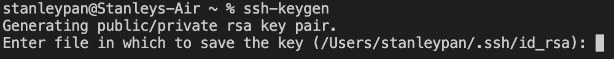

# Lab Report 1 - Remote Access

# **Tutorial: How to Log Into a Course-Specific Account with ieng6**
*Stanley Pan    |    1/14/22*

Hello everyone, and future self! Today, we will cover how to use `ieng6` as a method of remote access for any course-specific accounts. 

*Note: This guide will require you to download applications as well as being comfortable with using a terminal!*
***
## **Step 1: Installing Visual Studio Code**

The first step is downloading and installing Microsoft Visual Studio Code *(or VSCode for short)*. If you already have VSCode, great! If not, continue with Step 1.


Go to the [Visual Studio Code](https://code.visualstudio.com) website, and follow the steps in the website for download. Keep in mind that you should download it for your respective operating systems, like MacOS or Windows. In the example below, it is a MacOS download.


After downloading VSCode and the continuing on the following setup, you should be able to open the application and see something **similar to this**:


***
## **Step 2: SSH and Remotely Connecting**

If you are using a **Windows** computer, do this step before moving on. Please install [OpenSSH](https://docs.microsoft.com/en-us/windows-server/administration/openssh/openssh_install_firstuse#install-openssh-using-windows-settings), as we need to use the program in order to remotely connect to computers.

The next few steps are now for everyone. You must find your course-specific account for CSE15L now, using the link below:

[https://sdacs.ucsd.edu/~icc/index.php](https://sdacs.ucsd.edu/~icc/index.php)

You will likely be asked to reset your password for that course, so please do so before you find your account details. For this class, the account details should start with `cs15lwi22---`, with those hyphens actually being your own specific letters for identification. From now on, fill in your own login details for the hyphens.

After you have found your account details, go back to VSCode and open up the terminal (Do Ctrl/Command + `, or Terminal -> New Terminal). Then input the command below, but with *your account details* instead (which should only differ by the letters). 

`$ ssh cs15lwi22---@ieng6.ucsd.edu`

Again, the hyphens are where you put in your own login information.

If it is your first time connecting to the server, you will likely be asked if you want to continue connect, which you should say yes (by typing yes into the terminal). Then, you will see this:


From the terminal, it will show that you have successfully connected to a remote computer.

***

## **Step 3: Trying Some Commands**
Useful commands:
- `pwd`
- `cd` and `cd ~`
- `ls -lat` and `ls -a`
- `cp /home/linux/ieng6/cs15lwi22/cs15lwi22---`, where the hyphens are your username
- `cat <directory>` with the same directory above


*`pwd` is a useful command that shows the current directory!*


*Example of `ls -lat` command*

Use Ctrl-D or type `exit` in the terminal to exit.

***

## **Step 4: Moving Files with scp**

An extremely important command is `scp`, which copies files from your computer to the server. Note that `scp` is ran on *only the client*, not on the server (`ieng6`).

To demonstrate, create a file called findLocation.java:

```
class findLocation{
    System.out.println("I am at " + System.getProperty(user.dir));
}
```
Compile (`javac`) and run (`java`) findLocation.java on **your** computer. Take note of the results. Then, in the same terminal where the file was made, run the following command:

`scp findLocation.java cs15lwi22---@ieng6.ucsd.edu:~/`

You will be prompted for a password, which should be the same password when you used the `ssh` command earlier. 

Lastly, use `ls` to check if the file is there.

***

## Step 5: Setting an SSH Key

Go back to the **client**, and type `ssh-keygen` into the terminal:



You will be prompted to enter a file for where to save the key, and you should say it in the same directory written in parentheses above. For my case, it would be `/Users/stanleypan/.ssh/id_rsa`

Afterwards, it will prompt you to create a passphrase. The point of this step is to leave the prompt blank, as we want to make it easier to login:


To leave it empty, just press enter to continue. It will then ask you to enter the same passcode, and just press enter again.

In my case, I had to overwrite my previous passphrase as I have already set it up. You will most likely receive similar output from the terminal after setting up the passphrase, featuring a key randomart image.

Note: If on Windows, you will have to follow the [extra `ssh-add` steps](https://docs.microsoft.com/en-us/windows-server/administration/openssh/openssh_keymanagement#user-key-generation).

Afterwards, we copy the public key to the `.ssh` directory.

```
$ ssh cs15lwi22---@ieng6.ucsd.edu    // Login with ssh to access the server

$ mkdir .ssh      // makes the directory called .ssh
$ <exit the server>

$ scp /Users/<your username here>/.ssh/id_rsa.pub cs15lwi22---@ieng6.ucsd.edu:~/.ssh/authorized_keys
```
*Note: You should be using the same directory as the one in earlier steps.*

***

## **Step 6: Optimizing Remote Running**

Tips for having a smoother experience:
* Write commands with quotes "" after `ssh`

ex: `ssh cs15lwi22---@ieng6.ucsd.edu "pwd"`
* Using a colon for consecutive commands ;

ex: `javac findLocation.java; java findLocation`
* Copy-pasting common commands
* Having a clipboard of commonly - used commands
* Using the up arrow for previously used commands

Example of using *a lot of commands*:


Thank you for reading!