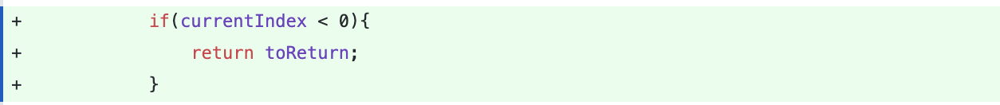
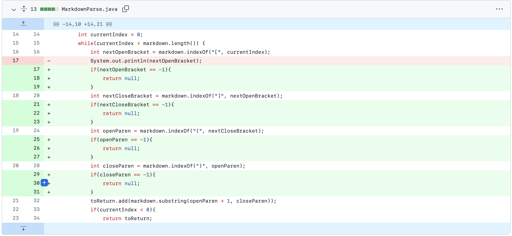
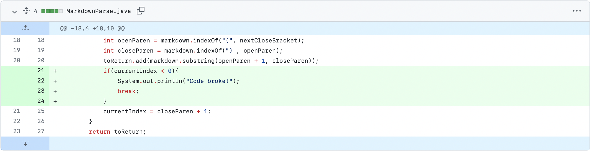
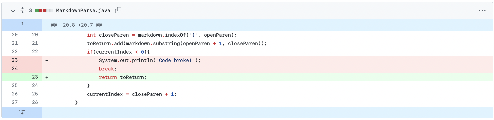

# Lab Report 2: When Tests Accumulate

## **Implementation of First Test**


[Error-Causing Test: (Link)](https://github.com/stanley-pan/markdown-parse/commit/ba15ad6241309afa02d51c3a448cc58846177004#diff-d902b3a6dba925548b7ea18ffb80dd0c28f1bc45f1d738a5da414273711a4409)

### **Output/Symptom of the Error:**
```
-1
42
-1
42
-1
42
-1
42
-1
42
-1
42
# ... infinite loop
```

In this first example, **underlying bug was revealed by the symptoms of the failure-inducing input**. 

In other words, the only way to detect if there was an underlying problem in the code was to first check if such problem-inducing inputs can cause an issue, where in this case the infinite loop between `-1` and `42` was the resulting symptom from that input. 

It reveals that there is an underlying issue *(a bug!)* with the code that causes these symptoms, which I tried to prevent by checking for negative values
***
## **Implementation of Second Test**



[Error-Causing Test: (Link)](https://github.com/stanley-pan/markdown-parse/commit/8fc6a30b39fa25b73da974c508389191bb4e3d75#diff-72d0164ca2d60c8d0fdc3b1a93d3e1a746eb8532639f111eda62faf046aa6f92)

### **Output/Symptom of the Error:**

```
2) getLinks2(MarkdownParseTest)
java.lang.StringIndexOutOfBoundsException: begin 0, end -1, length 20
        at java.base/java.lang.String.checkBoundsBeginEnd(String.java:4601)
        at java.base/java.lang.String.substring(String.java:2704)
        at MarkdownParse.getLinks(MarkdownParse.java:32)
        at MarkdownParseTest.getLinks2(MarkdownParseTest.java:26)
```

In this second example, the bug was likely due to the negative index that would be returned by the IndexOf() method. The bug's symptoms were indicated by the index out of bounds error, indicating that String would not be found from the test file, but continue running. This time, we checked after each indexOf() method.

***

## **Implementation of Third Test**
First Change:


But then quickly changed to: 



[Error-Causing Test: (Link)](https://github.com/stanley-pan/markdown-parse/commit/ba15ad6241309afa02d51c3a448cc58846177004#diff-c1ee2d48f5f64b4463a98907818b5846f49cc9dd67f88882a8b551106ec320fb)

### **Output/Symptom of the Error:**

```
-1
-1
-1
-1
-1
-1
-1
-1
-1
-1
-1
# ... infinite loop
```

In this last example, we tried to fix the bug discovered in the *first problem*. We tried a more comprehensive test in test-file2.md, where it had parentheses inside the link. 

We believed that the **symptom** (infinite -1 loop) was because currentIndex would end up not being found, returning -1 for currentIndex and then adding +1 would make it = 0, therefore never breaking from the while loop. Therefore, we tried to check if currentIndex was <0, then to break away from the loop. 

However, the same symptoms appeared (with an infinite loop) as a result from *this test*, therefore leaving us to believe that the **same bug still remained** from the first test implementation.