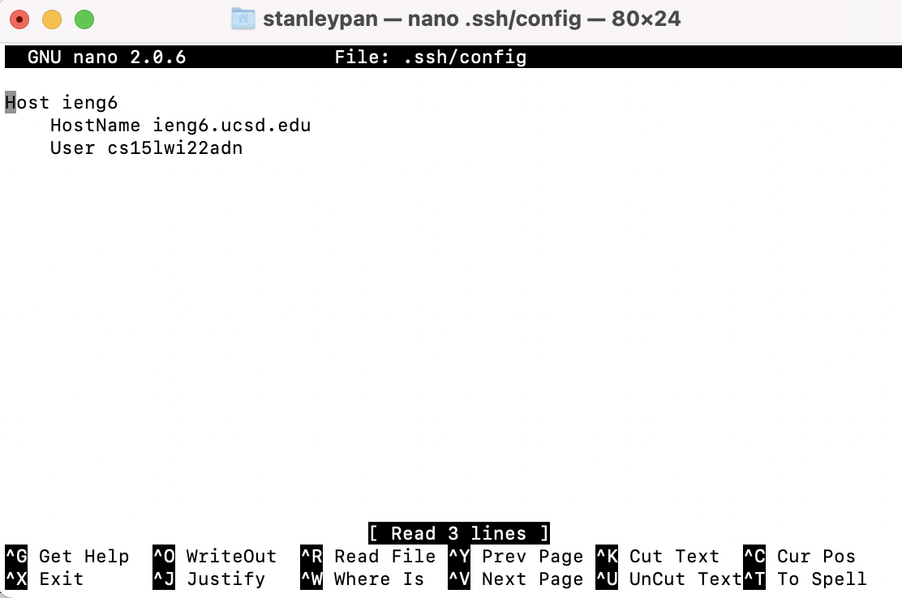
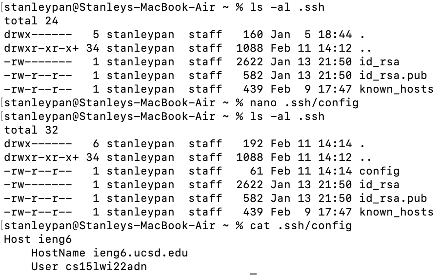
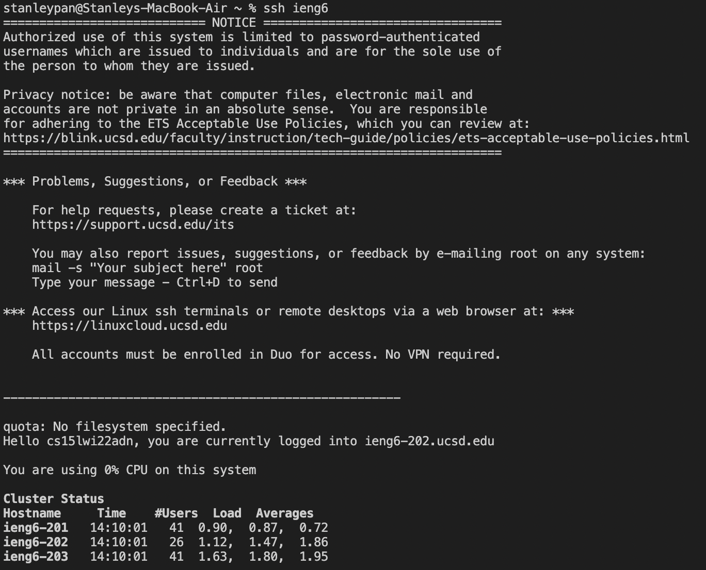

# Lab Report 3: Build and Run Automation

At first, I did not have the .ssh file on my home directly, so I had to create it first. To do so, I used my terminal and put `nano .ssh/config` to create the file and put in the command given in the prompt.

After doing so, I saved and exited out of nano, and then checked if the necessary files were there now.

I used `ls -al` to make sure the file was there, and then `cat` to make sure the .ssh/config file was correctly written.

Afterwards, I was able to log into ieng6 without typing the entire command, making it a lot more streamline.

