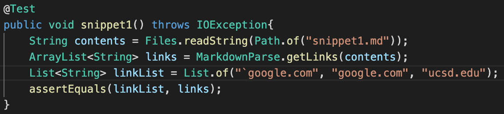
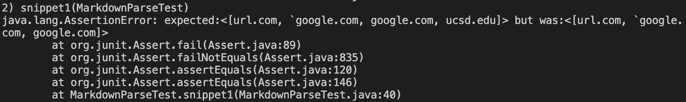
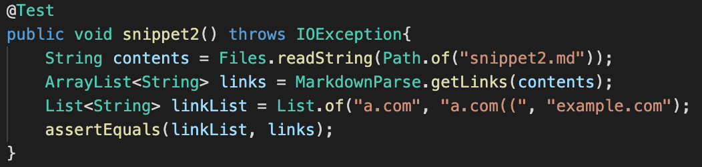
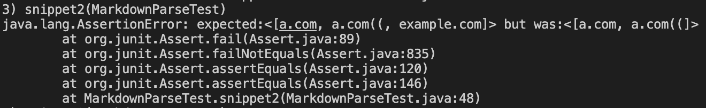
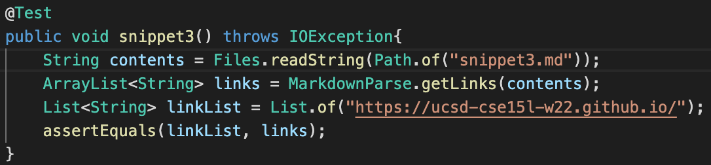
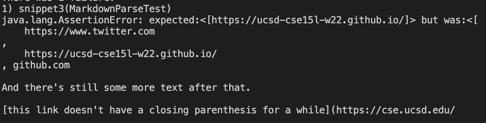
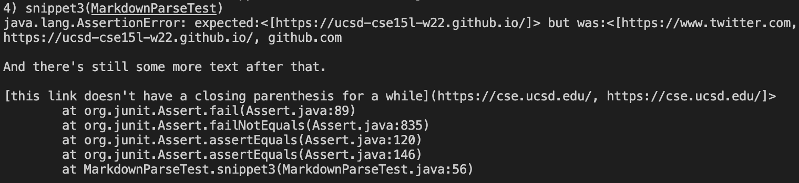

#  **Lab Report 4: Debuggers**

[Link to markdownparse repository](https://github.com/stanley-pan/markdown-parse)

[Link to peer repository](https://github.com/QijunHuMary/markdown-parse)
***
## **Snippet 1:**

### *My Test:*

Passed the first test.

### *Peer Result*

To fix the issue with back ticks, we can try to search the program for any back ticks, and then ignore them. Perhaps we can recreate the string without those back ticks.
***
## **Snippet 2:**

### *My Test:*

### *Peer Result*

For nested parentheses, we should not stop at the first instance of the close/open bracket/parentheses. Instead, we should have a counter to count the total pairs of those, and then reevalute what to print afterwards.
***
## **Snippet 3:**

### *My Test*

### *My Result*

### *Peer Result*

To avoid any issues with new lines in brackets and parentheses, we should check for spacing. Then, try to remove those extra spaces when reading the string for the indices of the parentheses/brackets.