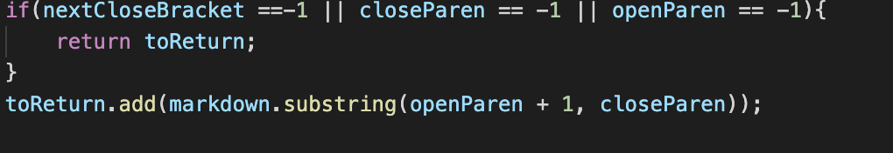

# Lab Report 5
To find the different test results, I used a bash script to print the results onto a results text file for each parser, and then used `diff` to compare the results of each markdown parser. After that, I chose the files that had differences.
***
## **Test 1:**

`579.md`
```

```
### *Mine & Parser result:*
```
[<url>]
```

I think that both parsers would be wrong in this case. In the markdown file used as the test, `579.md`, it is an image, indicated by the exclamation mark. Therefore, we should only print the links when they are actually links, and not images.

### *Actual/Expected input*
```
[]
```
***
My Code:


As we can see, my code does not check for an exclamation point in the beginning of the string at all. Instead, we should check if the first character (using substring) is an exclamation point, and then ignore that image in the md.

***
## **Test 2:**
`567.md`
```
[foo](not a link)

[foo]: /url1
```

### *My Result:*
```
[not a link]
```

### *Parser Result:*
```
[]  <-- (expected/actual result!)
```
I believe that the parser result is actually correct. The testfile should not contain a link because it does not include the standard extensions that one would expect in a link, like `.html` or `.md`. Therefore, it should not produce any links that do not have those extensions, which my parser does not detect.
***
My Code:


As we can see, my code does not check for any actual links. To fix the above issue, we should add an adidtional check where we check the substring from the openParen+1 to the closeParen, split each link by commas, and then check each String if they include an extension, likely through a .contains() or indexOf() with a string that contains all possible extensions.